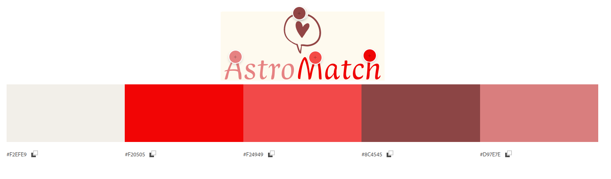
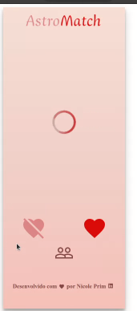

# Acesse o site:

<a href=http://astromatch-nicole.surge.sh/>AstroMatch</a>

## Sobre / Funcionalidades:

Ao acessar o AstroMatch, o usuário poderá dar like ou dislike nos perfis que forem apresentados. Ao dar like, se a pessoa retribuiu o like, aparecerá um toast com o aviso de que "deu match". Ao dar dislike, a imagem da pessoa deslizará para a esquerda e ao dar like a imagem da pessoa deslizará para a direita. O usuário pode clicar no ícone para ir para a página de matches, onde encontrará todas as pessoas em que deu like e foi retribuido. Nessa página, o usuário tem a opção de limpar os matches (quando clicar, aparecerá um toast com um aviso de que os matches foram limpos) e a opção de voltar para a página onde os perfis são apresentados. Quando o usuario finaliza os perfis, é apresentada uma mensagem em que é solicitado ao usuário que ele limpe os matches para começar novamente. A responsividade funciona. Tem um gif de "carregando" que aparece nos momentos em que está sendo trocado de página.

## Logo:

A Logo foi feita no Canva.

## Paleta de Cores:

A paleta de cores foi escolhida de acordo com a logo:

## Tecnologias utilizadas:

- React
- Axios
- Styled Components
- JavaScript
- Toast React

## Imagens:

## Desenvolvido por Nicole Prim
